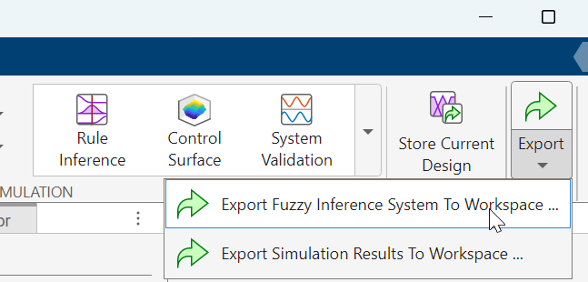
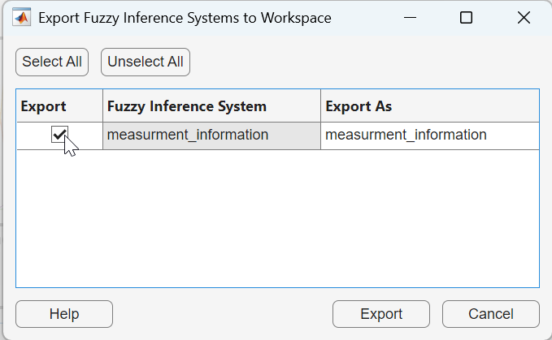

## Preparation steps

 - Install Matlab 2023b in your machine
 - Download most recent version of code repository [here](https://data.4tu.nl/datasets/319168f0-bc62-4051-84c2-f32718c05386/1), e.g. by running `git clone` command shared at the bottom of the page
 - Download most recent release of [raw simulation data](https://data.4tu.nl/datasets/2479c468-624b-49b6-9e2e-63bd633c9bc2), unzip recordings.zip and move unzipped recordings folder to code repository main folder
 - Open installed Matlab version and naviga

## Reproduce Results

Before starting reproducing the figures, make sure the repo main folder (./1284fd2b-663c-4c0d-9af7-7dc1ca390945) is displayed in Matlab's folder left panel.

### Figure 3

Run the following commands in the Matlab's terminal:

```Matlab
   addpath(genpath('.'))
   load('recordings/1_1f/env1.mat')
   plot_all_maps_environment(env_no_figures,0)
```

3 figures are created, of which 'Figure 3' is the map of the environment and corresponds to Figure 3 in the manuscript. Note that an earlier version of the software created the figure (in the paper) so it is slightly different. The differences are:

 - The map is flipped around the Y-axis
 - The planned paths of drones are plotted.
 - The map is generated for T=1 instead of T=0 so the positions of drones are slightly different.

### Figure 4

Figure 4 is a collection of 4 images (4A-D) that are reproduced separately.

**To reproduce Subfigure 4A:**

```Matlab
   addpath(genpath('.'))
   x=0:0.001:1;
   for i=1:1001
   y(i)=passibility_membership_function(x(i));
   end
   plot(x,y)
```

**To reproduce Subfigure 4B:**

```Matlab
   addpath(genpath('.'))
   x=0:0.001:1;
   for i=1:1001
   y(i)=reward_humans_membership_function(x(i));
   end
   plot(x,y)
```

**To reproduce Subfigure 4C:**

```Matlab
   addpath(genpath('.'))
   x=0:0.001:1;
   for i=1:1001
   y(i)=reward_exploration_membership_function(x(i));
   end
   plot(x,y)
```

**To reproduce Subfigure 4D:**

```Matlab
   addpath(genpath('.'))
   val=1;
   fis=readfis('certanity_unvisited.fis');
   for i=2:150
   val(i)=evalfis(fis,val(i-1));
   end
   plot(1-val)
```

### Figure 5

Figure 5 is a collection of 2 subfigures (Left and Right) that are reproduced separately.

To reproduce Subfigures 5 Left and Right we are going to use Matlab's Fuzzy Logic Designer tool.

**To reproduce Subfigure 5 Left:**

 - Run `fuzzyLogicDesigner` in the terminal. Two windows should appear in your screen: one named 'Fuzzy Logic Designer: Untitled' and 'Fuzzy Logic Designer: Getting started'.
 - In 'Fuzzy Logic Designer: Getting started', 'Open' section (top left), do a Browse action to select file `.\fuzzy\FIS\certanity.fis`. The file is loaded into the 'Fuzzy Logic Designer: Untitled' window, whose name changes to 'Fuzzy Logic Designer: certanity'

 

 - In 'Fuzzy Logic Designer: certanity', click on 'Export'(top panel) and then 'Export Fuzzy Inference System to Workspace'.
 
 

 - A window appears requesting to select options to be exported. Select 'certanity' and click 'Export'.

 

 - In the Matlab terminal, run the following commands:
 
  ```Matlab
     [X,Y,Z]=gensurf(certanity);
     surf(1-X,(Y+1)/2,1-Z)
  ```

  - These will generate a figure that corresponds to Subfigure 5 Left in the manuscript. Please use the "Rotation 3D" option you can find under the table 'Tools' to better visually check the comparison between the reproduced and published.

**To reproduce Subfigure 5 Right:**

 - Run `fuzzyLogicDesigner` in the terminal. Two windows should appear in your screen: one named 'Fuzzy Logic Designer: Untitled' and 'Fuzzy Logic Designer: Getting started'.
 - In 'Fuzzy Logic Designer: Getting started', 'Open' section (top left), do a Browse action to select file `.\fuzzy\FIS\measurment_information.fis`. The file is loaded into the 'Fuzzy Logic Designer: Untitled' window, whose name changes to 'Fuzzy Logic Designer: measurment_information'

 

 - In 'Fuzzy Logic Designer: measurment_information', click on 'Export'(top panel) and then 'Export Fuzzy Inference System to Workspace'.
 
 

 - A window appears requesting to select options to be exported. Select 'measurment_information' and click 'Export'.

  

 - In the Matlab terminal, run the following commands:
 
  ```Matlab
     [X,Y,Z]=gensurf(measurment_information);
     surf(X,Y,(Z+1)/2)
  ```

 - These will generate a figure that corresponds to Subfigure 5 Right in the manuscript. Please use the "Rotation 3D" option you can find under the table 'Tools' to better visually check the comparison between the reproduced and published.

### Figure 6

### Figure 7

Run the following commands in the Matlab's terminal:

```Matlab
   addpath(genpath('.'))
   load('recordings/large/4_2f/env1.mat')
   plot_all_maps_environment(env_no_figures,0)
```

3 figures are created, of which 'Figure 3' is the map of the environment and corresponds to Figure 7 in the manuscript. Note that an earlier version of the software created the figure (in the paper) so it is slightly different. The differences are:

 - The map is flipped around the Y-axis
 - The planned paths of drones are plotted.
 - The map is generated for T=1 instead of T=0 so the positions of drones are slightly different.

### Figure 8

Figure 8 is a collection of 4 subfigures that are reproduced separately.

**To reproduce Subfigure 8 Top Left:**

```Matlab
   addpath(genpath('.'))
   load('recordings\large\1_2f\env2861.mat')
   plot_all_maps_environment(env_no_figures,0)
```

3 figures are created, of which 'Figure 2' is the map of the environment and corresponds to Subfigure 8 Top Left in the manuscript. Note that an earlier version of the software created the figure (in the paper) so it is slightly different. The one difference is the map is flipped around the Y-axis

**To reproduce Subfigure 8 Top Right:**

```Matlab
   addpath(genpath('.'))
   load('recordings/large/1_4f/env2011.mat')
   plot_all_maps_environment(env_no_figures,0)
```

3 figures are created, of which 'Figure 2' is the map of the environment and corresponds to Subfigure 8 Top Right in the manuscript. Note that an earlier version of the software created the figure (in the paper) so it is slightly different. The one difference is the map is flipped around the Y-axis

**To reproduce Subfigure 8 Bottom Left:**

```Matlab
   addpath(genpath('.'))
   load('recordings\large\4_2f\env2221.mat')
   plot_all_maps_environment(env_no_figures,0)
```

3 figures are created, of which 'Figure 2' is the map of the environment and corresponds to Subfigure 8 Bottom Left in the manuscript. Note that an earlier version of the software created the figure (in the paper) so it is slightly different. The one difference is the map is flipped around the Y-axis

**To reproduce Subfigure 8 Bottom Right:**

```Matlab
   addpath(genpath('.'))
   load('recordings\large\4_4f\env2661.mat')
   plot_all_maps_environment(env_no_figures,0)
```

3 figures are created, of which 'Figure 2' is the map of the environment and corresponds to Subfigure 8 Bottom Right in the manuscript. Note that an earlier version of the software created the figure (in the paper) so it is slightly different. The one difference is the map is flipped around the Y-axis